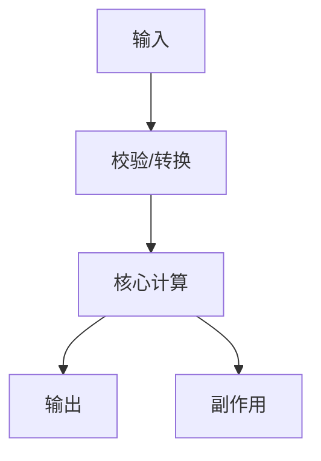

# Output Templates

<!-- @类型: 模板参考 -->
<!-- @目的: 保持源码阅读输出结构稳定，方便多轮导航和复盘 -->

## 1. 问题分类卡

```markdown
问题类别: 理解类 / 定位类 / 调用链类 / 架构类 / bug 类 / 需求类 / 重构类 / 施工类 / 复盘类
当前模式: 读模式 / 施工前边界 / 施工模式
本轮目标:
不做什么:
需要证据:
```

## 2. 项目识别卡

```markdown
项目目标:
技术栈:
入口候选:
核心路径:
边缘路径:
配置来源:
运行/测试入口:
不确定项:
```

## 3. 函数地图模板

````markdown
函数:
位置:
一句话职责:
输入:
输出:
副作用:
上游调用:
下游依赖:
容易误解:

地图:


读图顺序:
下一张图:
````

## 4. 调用链模板

````markdown
追踪对象:
定义点:
上游:
当前节点:
下游:
终点:
证据:


````

## 5. 字段旅程模板

````markdown
字段:
诞生位置:
初始含义:
转换位置:
存储位置:
消费位置:
展示/返回位置:
一致性风险:
证据:


````

## 6. 架构体检报告模板

```markdown
范围:
已检查证据:
总体判断:

发现 1:
严重度:
证据:
影响:
最小下一步:
验收方式:
回滚思路:

发现 2:
...

稳定性判断:
建议阅读路线:
下一问:
```

严重度建议：

- P0: 当前功能可能错误或不可运行。
- P1: 高概率造成后续修改不一致或难以验证。
- P2: 明显增加理解成本，但暂不阻断功能。
- P3: 风格或局部可读性问题。

## 7. 阅读路线模板

```markdown
建议先看 3-5 个文件:
1. path/to/file.ext
   读什么:
   解决什么:
   暂时跳过:
2. path/to/next.ext
   读什么:
   解决什么:
   暂时跳过:

看完后的检查问题:
- 我现在知道入口在哪里吗？
- 我知道核心数据结构从哪里来、到哪里去吗？
- 我知道下一层要追哪个函数/字段吗？
```

## 8. 施工边界卡

```markdown
问题类别:
目标:
涉及文件:
不涉及文件:
修改边界:
主要风险:
验收方式:
回滚方式:
```

## 9. 下一问模板

下钻：

```markdown
请只追踪 <函数/字段/组件/接口>，给我 L1 函数地图和它的上下游。
```

横向：

```markdown
请比较 <模块A> 和 <模块B> 是否在做重复的事，只给有证据的结论。
```

进入施工前：

```markdown
基于刚才的理解，把 <目标> 转成施工边界卡，先不要改代码。
```

复盘：

```markdown
把我们刚才问过的问题整理成问题树：已解决、未解决、下一步。
```

## 版本历史

- **v1.0.0** (2026-05-27) - 初始版本，提供核心输出模板。
